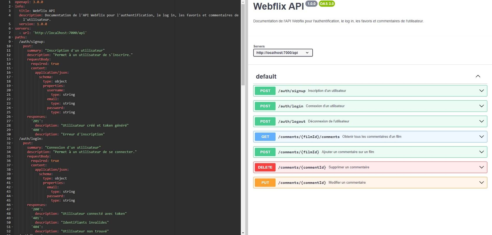

  

Webflix est un projet de portfolio que j'ai développé pour explorer et apprendre Vue.js, après avoir initialement créé une version de cette application avec PHP et Laravel durant ma première formation. Ce projet m'a permis de me familiariser avec Vue.js en tant que framework JavaScript et d'appliquer des concepts de développement web modernes.

## Table des matières

- [Présentation](#présentation)
- [Pages principales](#pages-principales)
- [Technologies](#technologies)
- [API utilisée](#api-utilisée)
- [Backend](#backend)

## Présentation

Webflix est une plateforme de gestion de films et d'acteurs, où les utilisateurs peuvent consulter des informations détaillées sur des films, des acteurs et leurs crédits. L'application offre une interface utilisateur agréable et intuitive, permettant une navigation fluide entre les différentes sections.

## Pages principales

1. **Page d'accueil** :

   - Landing Page classique pour la céation d'un compte ou le log in

2. **Pages des films/Series/Catégories/Acteurs** :

   - Présente une liste de films ou séries ou acteurs populaires et récents avec leurs affichages respectifs.
   - La page des catégories permet de filtrer les films selon le genre.

3. **Détails du film/série/acteur** :

   - Affichage des informations détaillées (synopsis, les acteurs principaux, la note, et d'autres détails pertinents.)

4. **Commentaires** :

   - La section commentaire est sur chaque page de détail d'un film, l'utilisateur peut donc voir tous les commentaires, ou ajouter le sien (il peut par la suite éditer son commentaire ou le supprimer).

5. **Page du compte utilisateur** :

   - Regroupe la liste des favoris de l'utilisateur

## Technologies

  

## API utilisée

Webflix utilise l'API [The Movie Database (TMDb)](https://www.themoviedb.org/documentation/api) pour récupérer des informations sur les films et les acteurs. Cette API fournit des données riches, y compris :

- Détails sur les films (titre, synopsis, date de sortie, note, etc.)
- Informations sur les acteurs (nom, biographie, date de naissance, etc.)
- Crédits de films pour chaque acteur
- et bien d'autres !

## Backend

Le backend de **Webflix** est une API REST construite avec **Node.js**, **Express**, et **MongoDB**. Cette API gère les interactions entre le frontend (Vue.js) et la base de données, permettant aux utilisateurs de s'inscrire, se connecter, et interagir avec les films, les commentaires et les favoris. Afin de faciliter la compréhension et l'utilisation de l'API, j'ai utilisé Swagger pour la documentation interactive des endpoints.

  

### Fonctionnalités du backend :

- **Authentification** :

  - L'API permet aux utilisateurs de s'inscrire et de se connecter à l'application via des endpoints dédiés (`/signup`, `/login`).
  - Les mots de passe sont sécurisés à l'aide de **bcrypt.js**, et un **JWT** est généré pour gérer l'authentification dans les requêtes suivantes.

- **Gestion des films** :

  - L'API utilise l'API externe **TMDb** pour récupérer des informations sur les films et les acteurs.
  - Les films sont affichés sur le frontend en récupérant les données depuis des endpoints comme `/films` et `/films/:id`.

- **Commentaires** :

  - Les utilisateurs peuvent ajouter, modifier et supprimer des commentaires sur les films, en utilisant des routes protégées par **middleware d'authentification**.
  - Seuls les utilisateurs authentifiés et l'auteur du commentaire peuvent le modifier ou le supprimer.

- **Favoris** :

  - Les utilisateurs peuvent ajouter ou retirer des films de leur liste de favoris. Cela est géré par des endpoints sécurisés qui nécessitent une session active (via JWT).

- **Middleware** :
  - Des **middlewares** sont utilisés pour gérer l'authentification avec JWT, vérifier les permissions des utilisateurs, et gérer les erreurs d'API.

### Sécurité et authentification

L'authentification des utilisateurs est assurée par le système de **JWT** (JSON Web Token). Lors de la connexion, un token est généré et retourné à l'utilisateur. Ce token doit ensuite être envoyé dans les en-têtes de chaque requête sécurisée (comme pour modifier ou supprimer des commentaires). Ce système garantit que seules les personnes authentifiées peuvent accéder aux fonctionnalités sensibles de l'application.

Les routes de commentaires et de favoris sont protégées par un **middleware d'authentification** qui vérifie la validité du token à chaque requête, assurant que les actions ne peuvent être effectuées que par des utilisateurs authentifiés.

## Fonctionnalités clés

- **Authentification des utilisateurs** : Inscription, connexion, et gestion des sessions utilisateur.
- **Commentaires** : Les utilisateurs peuvent ajouter, modifier, et supprimer leurs commentaires sur les films qu'ils consultent.
- **Films favoris** : Les utilisateurs peuvent ajouter des films à leur liste de favoris ou les retirer.

## Démo

ici
